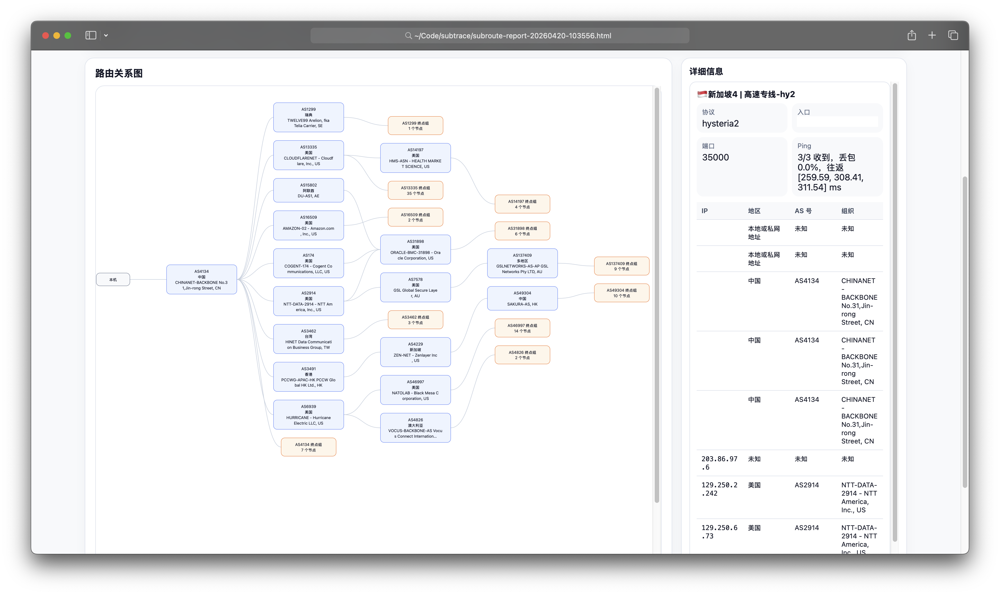

# subroute

Generate an HTML route report for proxy subscription nodes.



## Quick Start

### 1. Download a release build

Download the latest macOS binary from the [GitHub Releases page](https://github.com/LanternCX/subtrace/releases) and extract it.

### 2. Run the binary

```bash
./subroute "https://example.com/subscription"
```

The command fetches the subscription, probes each parsed node, enriches route hops with AS information, and writes an HTML report in the current directory.

### 3. Choose an output path

```bash
./subroute "https://example.com/subscription" --output report.html
```

### 4. Control probing concurrency

```bash
./subroute "https://example.com/subscription" --concurrency 8
```

When `--concurrency` is omitted, all parsed nodes are probed concurrently.

### 5. Control traceroute depth

```bash
./subroute "https://example.com/subscription" --max-hops 20
```

## Notes

- The tool expects a Base64 proxy subscription URL.
- The generated report is a standalone HTML file.
- Route probing relies on system `ping` and `traceroute` commands.
- AS metadata lookup is performed for discovered route IPs.
